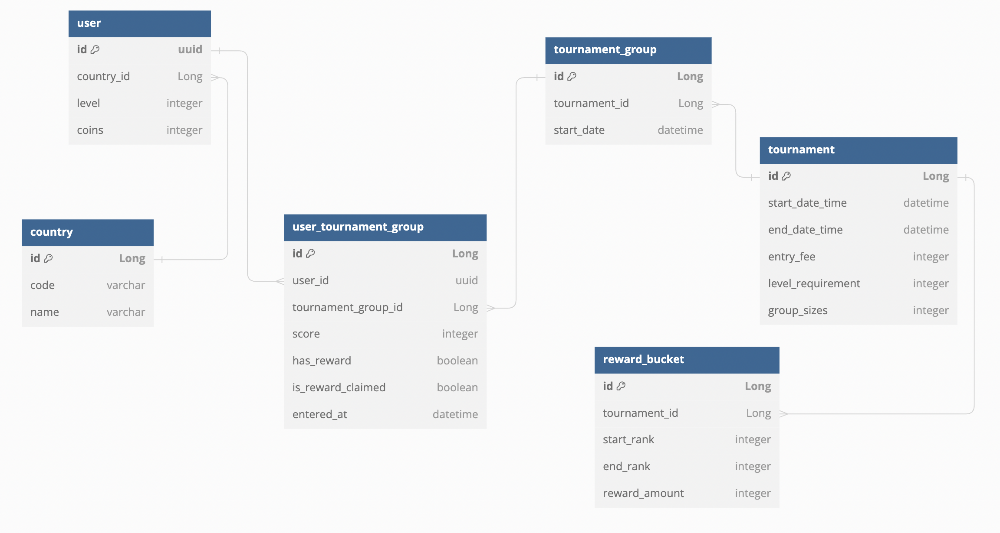

# Backend Engineering Case Study

## Veritabanı Modeli

### Açıklama
Servislerimde kullanmak için yukarıdaki gibi bir veritabanı modeli oluşturdum.
Günlük olcak turnuvadan başka turnuvalar ileride eklenebileceğinden turnuva zamanı ve kullanı gereksinimlerini bu tabloda tutuyorum.
Turnuvaları bir cron job ile günlük olarak oluşturuyorum. Ödülleri gruplarını reward bucket tablosunda tutarak farklı ödüllendirme durumlarını eklenebilir hale getirdim.
User Tournament Group tablosunda da kullanıcıların turnuva katılımlarını ve bilgilerini tutuyorum.

## İmplementasyon Detayları
3 ana servis kullandım.
### 1. User Service
Kullanıcı oluşturuyor ve kullanıcının ilerlemesini sağlıyor. Eğer kullanıcı turnuvadaysa turnuva servisini kullanarak turnuva skorunu güncelliyor.
### 2. Tournament Service
Kullanıcıyı turnuvaya ekliyor. Eklerken bir turnuva grubu bulmaya çalışıyor ülkesinden katılımı olmayan.
Eğer bulamazsa yeni bir turnuva grubu oluşturuyor. 
Turnuva gruplarının adil olması için turnuva gruplarına level aralıkları belirlenebilirdi.
Turnuva sonrası ödülleri kullanıcıların gruplarındaki skorlara göre aggregate edip sıralamaları belirleniyor ve girdikleri reward buckettaki ödülü claim reward endpointinden alabiliyorlar.
Turnuva grubunun turnuvaya başlamasını grubu dolduran kullanıcı sağlıyor.
### 3. Leaderboard Service
UserTournamentGroup relationındaki skorları kullanarak sıralamaları dönüyor.

## Kullanım
[DreamGames.postman_collection.json](DreamGames.postman_collection.json) dosyasından collectiona ulaşabilirsiniz.
Docker compose up ile çalıştırıldığında MySQL daha connection almak için hazır olmadan uygulamanın başlaması durumunu engellemek için docker-compose.yml'a depends-on ve restart on failure ekledim. Bu yüzden doğru başlaması için birkaç defa tekrar başlayabilir container.